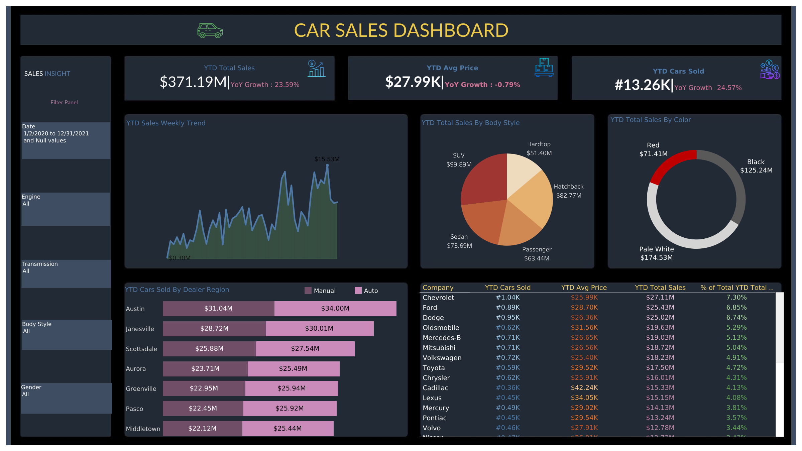

# 🚗 Car Sales Dashboard (Tableau Project)

## 📌 Overview

This project presents an interactive Car Sales Dashboard developed using Tableau to analyze and monitor sales performance.
It transforms raw data into meaningful insights, helping understand trends, customer preferences, and regional performance.

---

## ❓ Problem Statement

Businesses often struggle to track sales performance and identify key trends due to scattered or unstructured data.
This project aims to provide a centralized dashboard to monitor KPIs and support data-driven decision-making.

---

## 🎯 Objectives

* Track key performance indicators such as total sales, average price, and units sold
* Analyze sales trends over time
* Identify top-performing regions and product categories
* Understand customer preferences based on car attributes

---

## 🛠️ Tools & Technologies

* Tableau Public
* Microsoft Excel

---

## 📂 Dataset

The dataset contains car sales information including:

* Sales revenue
* Car body type
* Color
* Region
* Company/brand

(Data was cleaned and prepared using Excel before visualization.)

---

## 📊 Key Insights

* Identified Year-to-Date (YTD) sales growth and performance trends
* Analyzed weekly sales patterns to detect peak sales periods
* Found that certain body styles and colors have higher demand
* Highlighted top-performing regions contributing maximum revenue
* Compared company-wise sales performance to identify leading brands

---

## 📸 Dashboard Preview



---

## 🚀 How to Use

1. Download the `.twbx` file from this repository
2. Open it using Tableau Public or Tableau Desktop
3. Interact with filters and visuals to explore insights

---

## 📁 Project Structure

```
car-sales-dashboard/
│
├── data/            # Excel dataset
├── dashboard/       # Tableau workbook (.twbx)
├── images/          # Dashboard screenshots
├── README.md
```

---

## 📈 Business Impact

* Enabled quick identification of high-performing regions and categories
* Improved understanding of sales trends and customer preferences
* Supported better decision-making through interactive visual insights

---

## 💡 Future Improvements

* Integrate real-time or live data sources
* Add predictive analytics for sales forecasting
* Expand dashboard with advanced filters and drill-down features

---

## 👤 Author

**Tharun Kolipaka**

---

## ⭐ Acknowledgment

This project was created for learning and portfolio purposes to demonstrate data visualization and analytical skills using Tableau.
